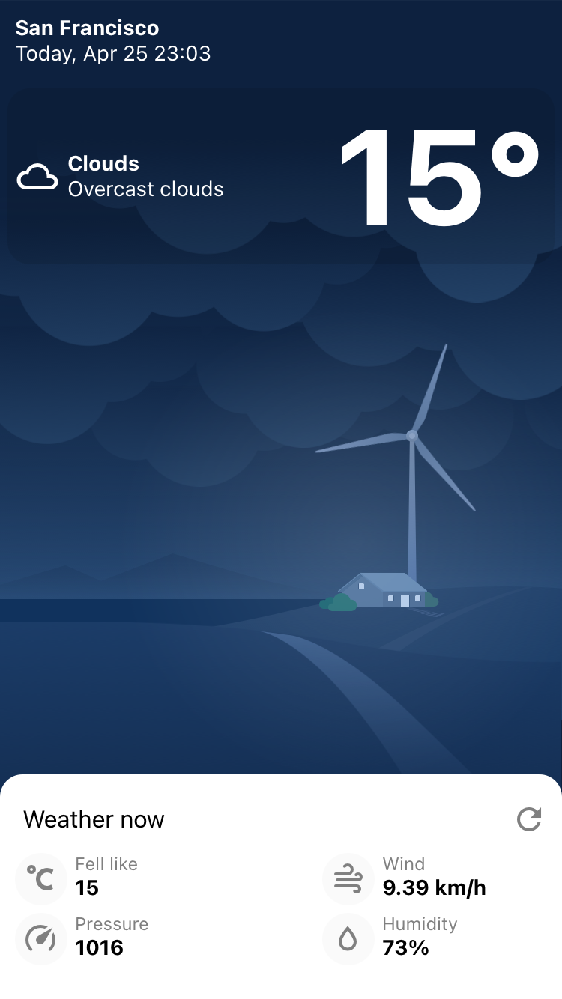
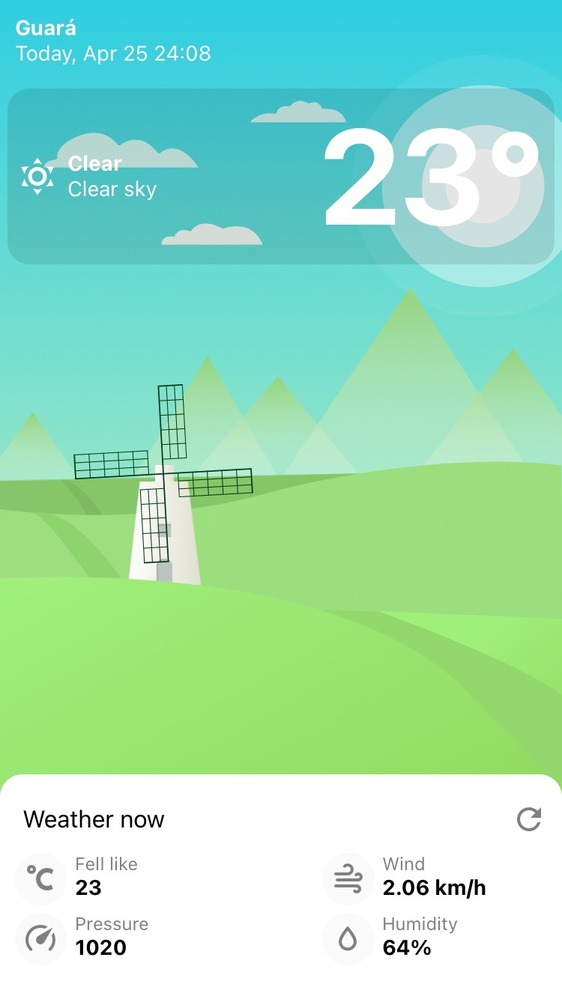

# Sobre a aplicação

Esse aplicativo é feito em react native, a proposta dele é exibir as condições climática da localização atual do usuário.

# O que foi utilizado?

O aplicativo é bem simples, conta com uma tela com detalhes sobre o tempo.

Para seguir o projeto proposto pela empresa utilizamos.

- react-native-toast-message: exibir toast
- lottie-react-native: adicionar animações
- expo-location:  informações de geolocalização
- axios:  cliente http
- typescript
- expo

# Telas

  
  

